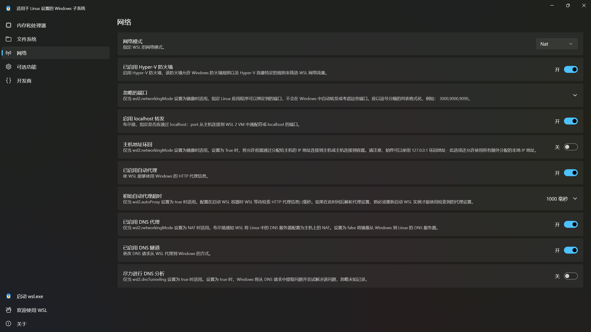

# Windows 11 LSTC 中 WSL 的配置

## 系统设置

到控制面板的程序与功能里面勾选：

###### 适用于Windows的Linux子系统 

###### Hyper-V 

###### 虚拟化平台

打开后重启电脑

## 安装 WSL （Win Terminal）

用管理员打开 Windows Terminal 升级内核

```txt
wsl --update 
```

看一下版本是不是wsl2，如果不是则设置默认版本为2

```
wsl --list --verbose
wsl --set-default-version 2
```

设置路径（比如D:\WSL\Arch）安装archlinux或其他发行版

```
wsl --install -d archlinux --location D:\WSL\Arch
```

出现done！则表示安装成功，输入下面代码进入默认子系统，使用help进行验证

```
wsl
pacman --help
```

打开文件浏览器，可以看到linux-archlinux文件

## 设置 WSL （WSL Terminal）

查看当前Linux用户与当前路径

```
whoami
pwd
```

目前用的是root用户，先设置root密码

```
passwd
    # 输入 root 的密码
```

安装sudo与vim包

```
pacman -S sudo vim

# 创建一个 vi 的软连接指向 vim
ln -s /usr/bin/vim /usr/bin/vi

# 授予 wheel 组执行 sudo 的权限
visudo
    # 按 /wheel 搜索，回车确认
    # 方向键找到 # %wheel ALL=(ALL:ALL) ALL 行
    # 按 home键 去行首
    # 按 x 或 del键 去掉 # 号注释（百分号不许删！！
    # 按 :wq 保存退出
```

可用vim修改镜像源/etc/pacman.d/mirrorlist，将以下清华源链接粘贴最上面

```
Server = https://mirrors.tuna.tsinghua.edu.cn/archlinux/$repo/os/$arch
```

更新系统

```
sudo pacman -Syyu
```

同步时间

```
# 设置时期
ln -sf /usr/share/zoneinfo/Asia/Shanghai /etc/localtime

# 用 NTP 同步时间
timedatectl set-ntp true

# 生成 /etc/adjtime
hwclock --systohc
    # 这个命令假定已设置硬件时间为 UTC 时间。
```

同步区域

```
# 修改区域和本地化设置
vim /etc/locale.gen
    # 输入 /en_US 搜索，回车确认
    # 方向键找到 en_US.UTF-8 UTF-8 行
    # 按 home 键 去到行首
    # 按 x 或 del键 去掉 # 号注释
    # 按 :wq 保存退出

# 生成本地化设置
locale-gen
    # 之后安装了图形界面和中文字体后
    # 可启用 /etc/locale.gen 中的 zh_CN.UTF-8 行
    # 并重新执行 locale-gen 命令（非root需要sudo）

# 修改系统语言（全局设置）
echo "LANG=en_US.UTF-8" >> /etc/locale.conf
    # 这个文件应该是空的
    # 一般不建议直接将它设为中文（但 Windows Terminal 里可以直接显示中文）
```

创建新用户（比如elysia）日常使用，尽量不用大写字母

```
useradd -m -G wheel elysia
passwd elysia
    # 输入 elysia 的密码
```

设置WSL以创建的新用户身份登陆

```
sudo vim /ect/wsl.conf

# 在文件中添加以下内容
[user]
default = elysia
```

保存后返回Win终端重启WSL，此时进入后的身份应该会是[elysia@xxx ~]，如果不是家目录可输入cd转跳

```
wsl --shutdown
wsl
```

## 基于 SSH 设定服务器（WSL Terminal）

安装必要的包

```
sudo pacman -S base-devel openssh git
```

配置sshd服务文件。这个文件中可以配置：

###### sshd 的监听端口（别人ssh登入时通过 -p 指定的端口，默认22）

###### sshd 的监听IP（默认是0.0.0.0，即所有IP） 

###### 禁止/启用登录root用户 

###### 禁止/启用密码或密钥登录

```
sudo vim /etc/ssh/sshd_config

# 在文件中进行以下修改（去注释）
Port 22
ListenAddres 0.0.0.0
PubkeAuthentication yes
PasswordAuthentication yes

# 保存后返回执行
sudo systemctl enable --now sshd
```

开启 OpenSSH 服务器

```
# 在Win终端执行
Add-WindowsCapability -Online -Name OpenSSH.Server~~~~0.0.1.0
# 出现进度条后等它跑到100%，如果输出结果里包含下面这三行，就说明安装成功了
# Path          :
# Online        : True
# RestartNeeded : False

# 启动服务并设置自启
Start-Service sshd
Set-Service -Name sshd -StartupType 'Automatic'
```

可将WSL端口加入Win防火墙的入站规则中

```
# 使用Win终端管理员
New-NetFirewallRule -DisplayName "WSL_SSH" -Direction Inbound -Action Allow -Protocol TCP -LocalPort 22

# 也可手动：
## 在“入站规则”界面的右侧，点击 新建规则...
## 选择 端口，点击“下一步”。
## 选择 TCP，并在“特定本地端口”中输入 22，点击“下一步”。
## 选择 允许连接，一路点击“下一步”。
## 最后给这个规则起个名字（比如就叫 SSH-Port-22），点击“完成”
```

可将台式机防火墙请求打开：

###### 搜索并打开“Windows Defender 防火墙”

###### 点击左侧的“高级设置”。

###### 点击左侧的“入站规则”，在中间列表找到 文件和打印机共享(回显请求 - ICMPv4-In)（如果有多个，找配置文件标着“专用”或“公用”的）。

###### 右键点击它，选择“启用规则”。

找到WSL setting软件，点击networkingMode，开启mirror镜像模式




此时 SSH 服务启动成功，现在需要返回WSL查询IP

```
wsl --shutdown
wsl
ip a
```

记住网卡eth0或者eth1的IP地址（inet后的第一组数字），在另外一个客户端（比如笔记本）打开Win终端

```
ssh -h # 一般笔记本会自带ssh，如果客户端没有就pacman一下
ssh 用户名@服务器IP
    # 输入用户密码
```

## 基于 SSH 设定客户端（Termux）

安装Termux到手机上，随后设定基本信息

```
termux-change-repo
# 第一个窗口选第一个，第二个窗口选第三个Chinese
```

安装ssh

```
# apt 可换 pkg
apt update # 也可apt upgrade 更新全部软件包
apt install openssh vim
```

尝试连接服务器

```
ssh 用户名@服务器IP
    # 输入用户密码
```

成功后我们创建密钥对

```
ssh-keygen -t ed25519 -C "for login wsl"
# 第一问路径，默认~/.ssh不用改
# 第二问密码，可以输入
```

将公钥拷贝到服务器里面

```
ssh-copy-id -i ~/.ssh/id_ed25519.pub 用户名@服务器IP
```

回到服务器中配置sshd服务文件/etc/ssh/sshd_config，禁用密码连接

```
PasswordAuthentication no
```

创建便捷名称连接服务器

```
vim ~/.ssh/config

# 将以容复制进去
Host wsl
    HostName 服务器地址 # IP
    Port 22 # 端口号
    User elysia # 服务器用户名（要登录服务器的哪个用户）
    IdentityFile ~/.ssh/id_ed25519 # 本地私钥
```

Termux输入以下代码即可连接服务器

```
ssh wsl
    # 输入密钥密码
```
