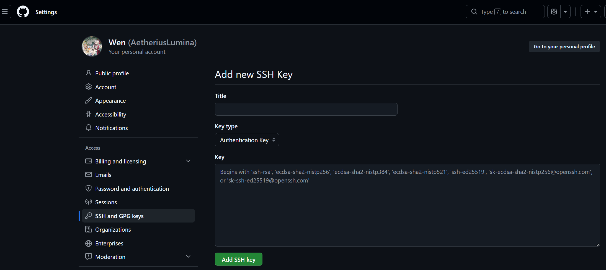
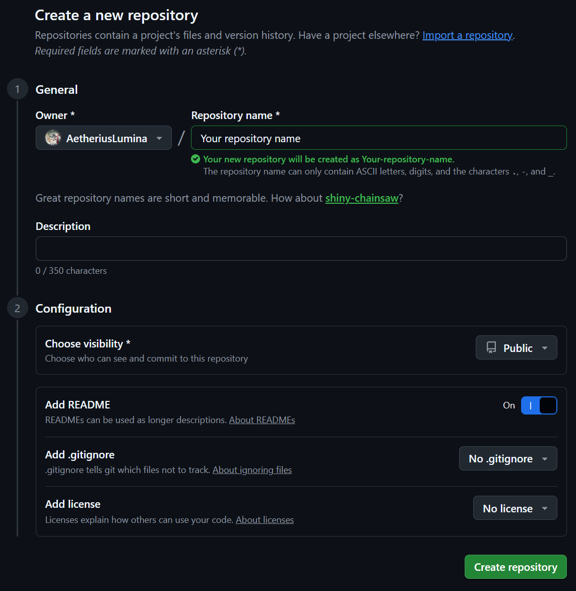

<h1 align="center">Windows 11 LSTC Workstation Guide</h1>

## 1 系统设置

到控制面板程序与功能里的“启用或关闭 Windows 功能”中勾选：

###### a. 适用于 Windows 的 Linux 子系统 

###### b. Hyper-V 

###### c. 虚拟化平台

打开后重启电脑

## 2 安装 WSL （Win Terminal）

用管理员打开 Windows Terminal 升级内核

```txt
wsl --update 
```

看一下版本是不是 wsl2，如果不是则设置默认版本为 2

```
wsl --list --verbose
```

```
wsl --set-default-version 2
```

设置路径（比如 D:\WSL\Arch）安装 archlinux 或其他发行版

```
wsl --install -d archlinux --location D:\WSL\Arch
```

```
# 失败了可去 ArchWSL 的 GitHub Releases 页面下载 .zip 压缩包，解压到 D:\WSL\Arch 文件夹中，双击运行里面的 Arch.exe 即可自动完成安装
```

出现 done！则表示安装成功，输入下面代码进入默认子系统，使用 help 进行验证

```
wsl
```

```
pacman --help
```

打开文件浏览器，可以看到 linux-archlinux 文件

## 3 设置 WSL （WSL Terminal）

查看当前 Linux 用户与当前路径

```
whoami
```

```
pwd
```

目前用的是 root 用户，先设置 root 密码

```
passwd
```

```
    # 输入 root 的密码
```

更新软件源

```
pacman -Syy
```

安装 sudo 与 vim 包

```
pacman -S sudo vim
```

创建一个 vi 的软连接指向 vim

```
ln -s /usr/bin/vim /usr/bin/vi
```

授予 wheel 组执行 sudo 的权限

```
 visudo
```

```
    # 按 /wheel 搜索，回车确认
    # 方向键找到 # %wheel ALL=(ALL:ALL) ALL 行
    # 按 home 键 去行首
    # 按 x 或 del 键 去掉 # 号注释（百分号不许删！！
    # 按 :wq 保存退出
```

可用 vim 修改镜像源 /etc/pacman.d/mirrorlist，将以下清华源链接粘贴最上面

```
sudo vim /etc/pacman.d/mirrorlist
```

```
# 按 i 后将以下内容复制粘贴到第一行
Server = https://mirrors.tuna.tsinghua.edu.cn/archlinux/$repo/os/$arch
# 按 Esc 后按 :wq 保存退出 
```

更新系统

```
sudo pacman -Syyu
```

同步时间

```
ln -sf /usr/share/zoneinfo/Asia/Shanghai /etc/localtime
```

```
timedatectl set-ntp true
```

```
hwclock --systohc
```

修改区域和本地化设置

```
vim /etc/locale.gen
```

```
    # 输入 /en_US 搜索，回车确认
    # 方向键找到 en_US.UTF-8 UTF-8 行
    # 按 home 键 去到行首
    # 按 x 或 del 键 去掉 # 号注释
    # 按 :wq 保存退出
```

生成本地化设置

```
locale-gen
```

```
    # 之后安装了图形界面和中文字体后
    # 可启用 /etc/locale.gen 中的 zh_CN.UTF-8 行
    # 并重新执行 locale-gen 命令（非 root 需要 sudo）
```

修改系统语言（全局设置）

```
echo "LANG=en_US.UTF-8" >> /etc/locale.conf
```

```
    # 这个文件应该是空的
    # 一般不建议直接将它设为中文（但 Windows Terminal 里可以直接显示中文）
```

创建新用户（比如 elysia）日常使用，尽量不用大写字母

```
useradd -m -G wheel elysia
```

```
passwd elysia
```

```
    # 输入 elysia 的密码
```

设置 WSL 以创建的新用户身份登陆

```
sudo vim /etc/wsl.conf
```

```
# 按 i 后在文件中添加以下内容
[user]
default = elysia
# 按 :wq 保存退出
```

保存后 CTRL + d 返回 Win 终端重启 WSL，此时进入后的身份应该会是[elysia@xxx ~]，如果不是家目录可输入 cd 转跳

```
wsl --shutdown
```

```
wsl
```

## 4 基于 SSH 设定客户端（WSL Terminal）

安装必要的包

```
sudo pacman -S base-devel openssh git
```

```
    # 输入 elysia 的密码
```

配置 sshd 服务文件。这个文件中可以配置：

###### a. sshd 的监听端口（别人 ssh 登入时通过 -p 指定的端口，默认 22）

###### b. sshd 的监听 IP（默认是 0.0.0.0，即所有 IP） 

###### c. 禁止/启用登录 root 用户 

###### d. 禁止/启用密码或密钥登录

```
sudo vim /etc/ssh/sshd_config
```

```
# 按 i 后，在文件中进行以下修改（去注释）
Port 22
ListenAddress 0.0.0.0
PubkeyAuthentication yes
PasswordAuthentication yes
# 按 Esc 后按 :wq 保存退出
```

返回终端执行

```
sudo systemctl enable --now sshd
```

此时 SSH 服务启动成功，保存后 CTRL + d 返回 Win 终端重启 WSL

```
wsl --shutdown
```

```
wsl
```

## 5 基于 Git 的简易项目仓库构建（WSL Terminal）

如果想要将本地项目上传至 GitHub，可使用 git 完成

在 WSL 里创建一对新的公钥（GitHub 专用）

```
ssh-keygen -t ed25519 -C "for Github"
```

```
# 第一问路径，可改为 /home/elysia/.ssh/id_ed25519_github 用于提示用途
# 第二问密码，可以自行设置
```

打印公钥并复制输出内容

```
cat ~/.ssh/id_ed25519_github.pub
```

登录 GitHub，点击右上角的头像 > Settings > SSH and GPG keys > New SSH key，将复制的公钥粘贴到文本框中，随意起一个名称，然后点击 Add SSH key



git 全局设置创建

```
vim ~/.gitconfig
```

```
# 按 i 后，根据 GitHub 用户名和绑定邮箱编辑
[user]
	name	= 
	email	=
# 按 Esc 后按 :wq 保存退出
```

进行 ssh 设置

```
vim ~/.ssh/config
```

```
# 按 i 后将以下内容复制粘贴进去
Host github.com
     Hostname ssh.github.com
     Port 443
     User git
     IdentityFile ~/.ssh/id_ed25519_github
# 按 Esc 后按 :wq 保存退出
```

测试 GitHub 能不能通过 ssh 连通

```
ssh -T git@github.com
```

```
# 看到疑问句后输入 yes，如果提示 successful 则表明连通无碍，密钥生效
```

在 GitHub 中创建一个新 repository 



拉取项目仓库到本地进行编辑

```
mkdir -p ~/my_repos
```

```
cd ~/my_repos
```

```
git clone git@github.com:GITHUB_USER_NAME/REPO_NAME  
```

```
# GITHUB_USER_NAME 是你想要拉取项目的创建用户，REPO_NAME 是你想要拉取的项目全称
```

用文件管理器查看 my_repos 文件夹里面有没有对应文件夹，检查内容是否被拉取下来（一个 README.md 和 .git文件）

下面你可以将本地项目整理放进去，其中 README.md 文件为项目说明书你可以编写，它会自动显示在项目主页的正下方

在本地 repo 根目录临时提交，放入暂存区

```
cd ~/my_repos/REPO_NAME
```

```
git add .
```

正式提交项目

```
git commit -m "写一个标题来记录本次提交/修改了什么"
```

向 GitHub 远程仓库推送

```
git push origin main
```

```
    # 输入密钥的密码
```

查看 GitHub 仓库是否有上传的项目，之后每一次修改本地项目都可以通过最后三步进行更新仓库操作

## 6 基于 Tailscale 的异地终端远程连接（WSL Terminal）

确保在第四节我们已经将 sshd 服务启动

安装 Tailscale 

```
sudo pacman -S tailscale
```

启动 Tailscale 

```
sudo systemctl enable --now tailscaled
```

登陆 Tailscale 账户，将终端输出的网址在浏览器打开，注册一个账户登陆，再返回终端

```
sudo tailscale up
```

```
# 例如输出：https://login.tailscale.com/x/xxxxx
```

查看当前账户下的设备 IP 与 域名（第二列）

```
tailscale status
```

现在我们称当前配置的客户端 A 为服务器

为了省心，可按照章节 1 ~ 4 配置另一台客户端 B，在登陆 Tailscale 账户后利用 ssh 连接服务器

```
ssh 被连接服务器用户名@服务器域名
```

```
# 有疑问句后输入 yes，之后输入在客户端 A 创立日常用户时设定的密码
```

不出意外，异地远程连接成功！

## 7（可选）将 WSL Terminal  更换成 fish 界面（WSL Terminal）

安装必要的包

```
sudo pacman -S fish eza bat
```

拉取项目，将配置放到指定位置

```
cd ~/my_repos
```

```
git clone https://github.com/Cornfy/dotfiles
```

```
cd
```

```
cp -r ~/my_repos/dotfiles/.config ~/
```

```
cp -r ~/my_repos/dotfiles/.local ~/
```

切换成 fish

```
chsh -s /bin/fish
```

```
      # 输入用户密码
```

CTRL + d 返回 Win 终端重启 WSL

```
wsl --shutdown
```

```
wsl
```

```
cd
```

此时输入代码时会有不同颜色显示，看得更清晰明了！


注：如果你更习惯操作图形界面，可以搭配使用远程桌面工具（如 ToDesk、向日葵、RustDesk、Anydesk 等）为了保证在外能随时稳定连上工作站，请务必提前做好以下“防失联”设置：

###### a. 在电源管理中设置禁止电脑休眠和息屏，并关闭“快速启动”功能

###### b. 为了防止重启后卡在锁屏界面，最好取消系统的开机密码（设置自动登录），并将远程软件和 WSL 设置为开机自启动并赋予所有最高权限（防止被系统弹窗卡死）

###### c. 建议在主板 BIOS 中开启定时开机或来电唤醒功能（可配合智能插座使用），以应对突发死机需要强制硬重启的情况